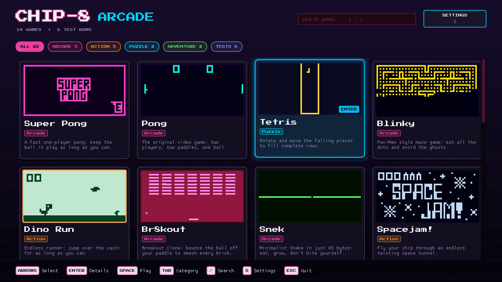
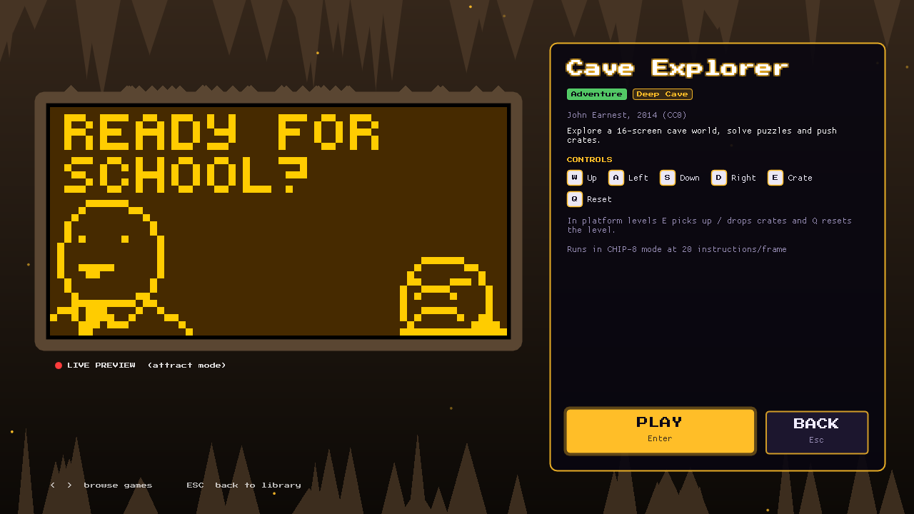
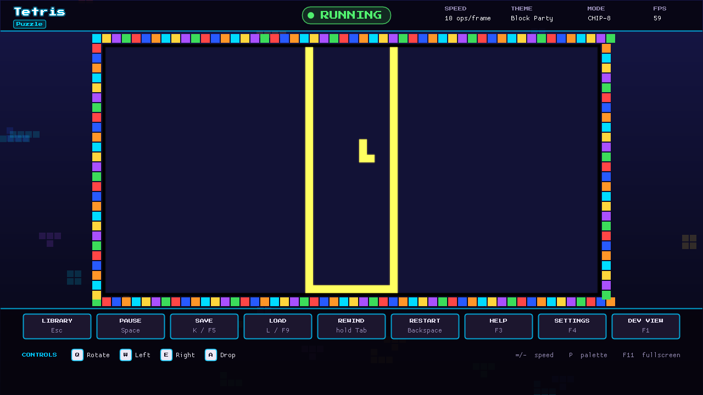
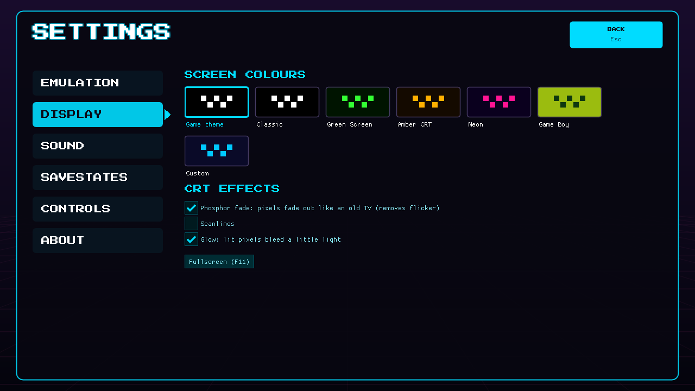

# CHIP-8 Arcade — a CHIP-8 emulator and game console (TatHack '26)


A CHIP-8 emulator in C++ with SDL2 graphics and audio. We started from the partially broken TatHack
codebase, found and fixed its bugs in the CPU, timing, rendering and audio, and added speed control,
savestates, colour palettes, rewind, a CRT effect, selectable sound waveforms, a switchable quirks mode,
**SUPER-CHIP support** (128×64 hi-res, scrolling, 16×16 sprites), a **developer view** with a live
debugger, breakpoints and ROM browser, and a complete **game-console front end**: a game library with
live previews, a page per game, per-game visual themes, an in-game HUD, and Settings / Help pages.
Automated tests run on Linux, macOS and Windows on every push.

| Game library | Game page |
|---|---|
|  |  |
| **In-game HUD** (the CHIP-8 screen is never covered) | **Settings** |
|  |  |

**Team:** <!-- TODO: Name (GitHub @username) for all 4 members -->

**Demo video:** <!-- TODO: unlisted YouTube link -->

---

## Quick start

### Windows (MSYS2)
1. Install MSYS2 from https://www.msys2.org
2. Open **MSYS2 MINGW64** and install the tools:
   ```bash
   pacman -S --needed make mingw-w64-x86_64-gcc mingw-w64-x86_64-SDL2
   ```
3. Build and run:
   ```bash
   make
   ./chip8.exe                 # opens with the ROM browser
   ./chip8.exe roms/Pong.ch8   # or start a game directly
   ```

### Linux / macOS
```bash
sudo apt-get install libsdl2-dev   # Ubuntu/Debian  (Arch: sudo pacman -S sdl2, macOS: brew install sdl2)
make
./chip8 roms/Pong.ch8
```

---

## Controls

### CHIP-8 keypad
```
Chip-8 Keypad:          Keyboard:
┌─┬─┬─┬─┐               ┌─┬─┬─┬─┐
│1│2│3│C│               │1│2│3│4│
├─┼─┼─┼─┤               ├─┼─┼─┼─┤
│4│5│6│D│               │Q│W│E│R│
├─┼─┼─┼─┤      =        ├─┼─┼─┼─┤
│7│8│9│E│               │A│S│D│F│
├─┼─┼─┼─┤               ├─┼─┼─┼─┤
│A│0│B│F│               │Z│X│C│V│
└─┴─┴─┴─┘               └─┴─┴─┴─┘
```

### In the game library
| Key | Action |
|-----|--------|
| Arrows / mouse | Select a game (the selected card plays a live preview) |
| `Enter` / click | Open the game's page (then `Enter` or **PLAY** to start, `←` `→` for other games) |
| `Space` | Play the selected game straight away |
| `Tab` | Next category (All, Arcade, Action, Puzzle, Adventure, Other, Tests) |
| `/` | Search |
| `S` | Settings |
| `Esc` | Back (in the library: quit, after asking) |

### In a game (added by us)
| Key | Action |
|-----|--------|
| `=` / `-` | Increase / decrease emulation speed (1–500 instructions per frame) |
| `P` | Cycle screen colours: the game's own theme → each palette |
| `M` | Toggle quirks mode: original CHIP-8 ↔ SUPER-CHIP |
| `Tab` (hold) | Rewind time (up to 10 seconds) |
| `G` / `H` | CRT phosphor fade on/off / scanlines on/off |
| `T` | Next sound waveform: square → sine → triangle → sawtooth |
| `[` / `]` | Beep pitch down / up by one musical semitone |
| `F5` or `K` | Save state (`K` works on Macs, where F-keys need `fn`) |
| `F9` or `L` | Load state |
| `Space` | Pause / resume (prints CPU state) |
| `N` | Step one instruction while paused (prints disassembly + registers) |
| `Backspace` | Restart the ROM |
| Drag & drop | Drop a `.ch8` file on the window to play it |
| `F3` / `F4` | Help page / Settings page (the game pauses) |
| `F1` | Developer view: debugger, breakpoints, ROM browser, panels |
| `F11` | Fullscreen |
| `Esc` or `F2` | Exit to the library |

Most of these are also buttons in the in-game HUD. `./chip8 <rom>` starts a game directly;
`--schip` forces SUPER-CHIP mode and `--classic` gives the original plain 640×320 window
(where `Esc` quits, as in the original).

Game tips (also shown in the in-app Help tab) — **Pong:** left paddle `1`/`Q`, right paddle `4`/`R`. **Tetris:** `Q` rotate, `W` left, `E` right, `A` drop. **Blinky:** `3` up, `E` down, `A` left, `S` right.

---

## Included games

Run `./chip8` with no arguments to open the **game library**. Every game has its own card, page,
visual theme and controls; its recommended mode, speed and screen-refresh setting are applied when
it starts.

| Game | Genre | Controls | Theme |
|---|---|---|---|
| Super Pong | Arcade | `E` serve, `A` / `D` move | Hot Neon |
| Pong | Arcade | `1`/`Q` left paddle, `4`/`R` right paddle (2 players) | Neon Arcade |
| Tetris | Puzzle | `Q` rotate, `W` left, `E` right, `A` drop | Block Party |
| Blinky | Arcade | `3` up, `E` down, `A` left, `S` right (SUPER-CHIP) | Ghost Maze |
| Dino Run | Action | `W` jump | Desert Sunset |
| Br8kout | Arcade | `A` / `D` move | Brick Wall |
| Snek | Arcade | `W` `A` `S` `D` | Green Terminal |
| Spacejam! | Action | `W` `A` `S` `D` (any key starts) | Deep Space |
| Outlaw | Action | `W` `A` `S` `D` move, `E` fire | Wild West |
| Cave Explorer | Adventure | `W` `A` `S` `D`, `E` crate, `Q` reset level | Deep Cave |
| Glitch Ghost | Adventure | `W` `A` `S` `D`, `E` haunt | Haunted Night |
| Piper | Action | `W` `A` `S` `D`, `E` hide | Beach Day |
| Flight Runner | Action | `A` / `D` steer | Blue Sky |
| Mini Lights Out | Puzzle | all 16 keys = the 4×4 grid | Light Grid |
| 8 test ROMs | Test | see each page | Test Lab |

Pong, Tetris and Blinky came with the original project. The other 11 games come from the
[CHIP-8 Archive](https://github.com/JohnEarnest/chip8Archive) (Creative Commons 0, public domain);
authors are listed in [`roms/games/CREDITS.md`](roms/games/CREDITS.md). They were written for the
Octo emulator, which does not wait for the screen refresh after each sprite draw, so the emulator
turns **"Wait for screen refresh"** off for them.

### Adding a game
1. Copy the `.ch8` file anywhere under `roms/`: it appears in the library straight away (category
   *Other*, with a live thumbnail and the default "Retro TV" theme).
2. Optionally add one entry to `GAMES` in [`src/games.h`](src/games.h): title, genre, author,
   description, controls, recommended speed/mode, and a theme (two screen colours, background
   gradient, accent colour and one of 15 decoration styles).

## Bugs found and fixed

| # | File | Bug | Symptom | Fix |
|---|------|-----|---------|-----|
| 1 | chip8.cpp | `00EE` read `stack[sp]` before decrementing `sp` | Games crash or jump to garbage after a subroutine | Decrement `sp` first, then read; added stack overflow/underflow checks |
| 2 | chip8.cpp | `8XY5`/`8XY7` used `>` for the no-borrow flag | Wrong VF when both values are equal | Use `>=` |
| 3 | chip8.cpp | `8XY4/5/6/7/E` wrote VF before the result | Wrong result when X = F (flags test) | Compute flag, write result, write VF last |
| 4 | chip8.cpp | `FX0A` advanced PC even with no key pressed | "Wait for key" didn't wait | Only advance when a key is pressed |
| 5 | chip8.cpp | `FX33` tens digit was `value/10` | Scores like 123 displayed wrong | `(value/10) % 10` |
| 6 | chip8.cpp | `FX55`/`FX65` loop used `i < x` | Last register not saved/loaded | `i <= x` |
| 7 | chip8.cpp / main.cpp | Timers decremented every instruction | Timers ran ~10× too fast | Decrement once per frame (60 Hz) |
| 8 | main.cpp | `SDL_Delay(16)` inside the 10-cycle loop | Everything ~10× too slow | Delay once per frame |
| 9 | main.cpp | Renderer used `(31 - y)` | Screen upside down | Use `y` |
| 10 | main.cpp | Square wave period gave ~220 Hz | Beep an octave too low | Correct the period for 440 Hz |
| 11 | Makefile | Hard-coded `-lSDL2` | Build failed on Windows | Use `sdl2-config --cflags/--libs` (portable) |
| 12 | chip8.cpp | No bounds checks on PC, I, key index, font digit | A bad ROM could read/write outside the 4 KB array | Mask addresses to 12 bits (`& 0xFFF`), keys/digits to 4 bits |
| 13 | main.cpp | `keymap` stored SDL key codes as `uint8_t` | Works only by luck for ASCII keys | Use `SDL_Keycode` |
| 14 | main.cpp | `beeping` flag shared with the audio thread without locking | Data race | `SDL_LockAudioDevice` around the update |

### How we found them
- Read each opcode against the CHIP-8 reference (Cowgod's technical reference).
- Ran the **Timendus CHIP-8 test suite** (`roms/test/`). `3-corax+` and `4-flags` show a ✔/✘ per opcode,
  so each fix could be verified.
- Watched the symptoms in the games (upside-down Pong, slow gameplay, Tetris crashing).

**Result:** `3-corax+` ✔ all opcodes, `4-flags` ✔ all flags (including the X = F cases),
`5-quirks` ✔ all six checks in CHIP-8 mode.
<!-- TODO: add before/after screenshots of 3-corax+ and 4-flags -->

---

## Features added

### 1. Configurable emulation speed
The main loop runs at a fixed 60 frames per second. Each frame executes `cycles_per_frame`
instructions (default 10 = 600 instructions/second, range 1–100), changed live with `=` / `-`.
Timers tick once per frame, **independent of CPU speed**, so games keep correct timing even when
the CPU is sped up. Frame pacing uses `SDL_GetPerformanceCounter` and only sleeps for the time left
in the frame.

### 2. Savestates
The whole machine state (memory, V0–VF, I, PC, stack, SP, timers, display) is written to a binary file
with a 4-byte magic header `C8SV` and a version byte. Loading reads into a temporary copy, checks the
header, file length and value ranges (PC, I, SP), and only then replaces the live state, so a corrupt
or edited file can't crash the emulator. Each ROM gets its own save file (`<rom>.c8s`).
Tested: save → load → both copies produce identical output; truncated, garbage and missing files are
rejected with a message and the running game is untouched.

### 3. Colour palettes
`P` cycles through a table of `{foreground RGB, background RGB}` palettes: **Classic** (white/black),
**Green Screen** (#33FF33), **Amber CRT** (#FFB000), **Neon** (hot pink on dark purple) and
**Game Boy** (dark green on light green), plus a **Custom** palette whose two colours can be picked
with colour pickers in the control panel. Adding a palette is one line in the `PALETTES` table.

### 4. Pause & step debugger with disassembler (bonus)
`Space` pauses and `N` executes one instruction. Each step prints the program counter, the next
opcode **disassembled into readable assembly**, and all registers:
```
PC=21A  OP=D015  DRW V0, V1, 5       I=2A0  SP=1  DT=00  ST=00
V0=0C V1=08 V2=00 V3=00 V4=00 V5=00 V6=00 V7=00
V8=00 V9=00 VA=00 VB=00 VC=00 VD=00 VE=00 VF=00
```

### 5. Switchable quirks mode (bonus)
The original 1977 COSMAC VIP CHIP-8 and the later SUPER-CHIP behave differently in a few
instructions, and games are written for one or the other. `M` switches between them:

| Behaviour | CHIP-8 (default) | SUPER-CHIP |
|---|---|---|
| `8XY1/2/3` reset VF | yes | no |
| `8XY6/E` shift source | VY | VX |
| `FX55/65` change I | I += X + 1 | unchanged |
| Draws per frame | 1 (waits for screen refresh) | unlimited |
| `BNNN` jump | NNN + V0 | XNN + VX |

The Timendus `5-quirks` test passes all six checks in **both** modes; Blinky needs SUPER-CHIP mode.

### 6. Rewind
Hold `Tab` to run time backwards. Every frame, a copy of the whole machine (the `Chip8` object, ~12 KB
of plain arrays) is pushed onto a history of the last 600 frames (10 seconds, ~7 MB). While `Tab` is
held, one state per frame is popped off and restored, so the game plays backwards at normal speed.
A `std::deque` is used so the oldest state can be dropped from the front in constant time. This
reuses the same idea as savestates, but in memory instead of a file.

### 7. CRT effect
- **Phosphor fade (`G`, on by default):** each pixel has a brightness that jumps to 1.0 when lit and
  decays by ×0.6 per frame when off; the colour is blended between the palette's background and
  foreground. Real CRT phosphor glows briefly the same way. CHIP-8 games erase and redraw sprites
  every frame, so this also removes most of the flicker.
- **Scanlines (`H`):** a semi-transparent black line over every other row of screen pixels.

### 8. Sound waveforms
The beep is generated with a **phase accumulator**: each audio sample advances a phase by
`frequency / sample_rate`, and the waveform function turns the phase into a sample
(square, sine, triangle or sawtooth). This gives the exact frequency at whatever sample rate the
sound card provides. `[` / `]` change the pitch by one semitone (×2^(1/12)), from 110 Hz to 1760 Hz.
The settings are shared with SDL's audio thread, so they are only changed while holding
`SDL_LockAudioDevice`.

### 9. SUPER-CHIP support (bonus)
The SUPER-CHIP extension (1991) adds a high-resolution mode and new instructions, all implemented:

| Opcode | Meaning |
|---|---|
| `00FF` / `00FE` | Switch to 128×64 high resolution / back to 64×32 |
| `00CN` | Scroll the screen down N pixels |
| `00FB` / `00FC` | Scroll right / left 4 pixels |
| `DXY0` | Draw a 16×16 sprite (32 bytes) |
| `FX30` | Point I at the large 8×10 font digit VX |
| `FX75` / `FX85` | Save / load V0..VX to the "RPL user flags" |
| `00FD` | Exit the program |
| `BXNN` | (SUPER-CHIP mode) jump to XNN + VX |

The screen buffer is 128×64; pixel (x, y) is `display[x + y * screen_width()]`, so in 64×32 mode
only the first 2048 entries are used and the original code paths are unchanged. The renderer
draws the CHIP-8 screen into a small texture (one texel per CHIP-8 pixel) and lets the GPU stretch
it to the window, which works for both resolutions and any window size. Savestates were updated to
format version 2 to include the new state. Verified with the Timendus `8-scrolling` test (low and
high resolution) and `5-quirks` in SUPER-CHIP mode.

### 10. Developer view: control panel, debugger and ROM browser (bonus)
Built with [Dear ImGui](https://github.com/ocornut/imgui) (MIT licence, vendored in `third_party/imgui`),
drawn with SDL's renderer. Press `F1` in a game (or the **DEV VIEW** button) to switch to it.
- **Controls:** pause/step/restart, hold-to-rewind, speed slider, save/load, mode, palette (with
  colour pickers for Custom), CRT options, waveform and pitch, test beep.
- **Keypad:** the 16 CHIP-8 keys in their original 4×4 layout. They light up when pressed, and can be
  held with the mouse. For known games each key is **labelled with what it does in that game**
  (e.g. "Rotate" on Q in Tetris).
- **Help tab:** for the loaded game, a table of *action → keyboard key → CHIP-8 key*, tips, and an
  **Apply recommended settings** button (e.g. Blinky: SUPER-CHIP mode, speed 30); below that, every
  emulator shortcut and the keyboard ↔ keypad map. It opens automatically when a known game loads.
  The per-game key assignments (in `src/games.h`) were found by reading each ROM's key-check
  instructions (`EX9E`/`EXA1`) in the disassembler and seeing what the code does next.
- **Debugger:** live registers, stack, and a disassembly listing with the current instruction
  highlighted. **Breakpoints:** click a line (or type an address) and the emulator pauses when PC
  reaches it.
- **ROM browser:** lists every `.ch8` file under `roms/` (using `std::filesystem`) with a search box;
  click to load.

ImGui is an "immediate mode" UI: the panels are rebuilt from the emulator state every frame, so they
can never get out of sync with it. While a text box is being typed in, keys are not passed to the game.

### 11. Game-console front end (bonus)
The emulator opens like a small games console instead of a terminal program:
- **Game library** (`src/hub.cpp`, `src/library.cpp`): a card per ROM found under `roms/`, with
  genre, description and a **thumbnail that is a real capture of the game**: each ROM is run for
  five seconds without a window and its busiest screen is kept, so there are no image files. The
  selected card plays a **live preview** (attract mode). Categories, search, keyboard and mouse
  navigation, cards that slide in, a glow on the selected card, and empty / loading / error states
  (a broken file shows "NO SIGNAL" static and a clear error message instead of crashing).
- **Game page:** large live preview in the game's theme, author and licence, description,
  controls as key caps, tips, the settings it runs with, and Play / Back.
- **Per-game visual identity** (`src/themes.cpp`): every game has its own two screen colours,
  background and decorated frame, all drawn with lines, rectangles, circles and triangles (15
  styles: neon synthwave floor, falling blocks, green terminal with scrolling hex, ghost maze with
  pellets, brick wall, starfield with a planet, desert sunset, wooden planks, cave, clouds, light
  grid, beach with waves, graveyard at night, blueprint lab, retro TV). The ImGui interface
  also takes the game's accent colour.
- **In-game HUD:** top bar (game, RUNNING / PAUSED / REWIND light, speed, colours, mode, FPS) and
  a bottom bar of buttons (Library, Pause, Save, Load, hold-to-Rewind, Restart, Help, Settings,
  Dev view) plus the game's controls as key caps.
  **The CHIP-8 screen is never covered:** everything made with ImGui is drawn first, and the game
  picture is drawn on top of it afterwards.
- **Settings page:** emulation speed with presets, mode, screen-refresh wait; colour swatches and
  custom colours; CRT effects; waveform buttons that show their shape, pitch, test beep; savestate
  info; the full keypad map and shortcuts; credits.
- **Help page:** the current game's controls, tips, and the keypad with this game's actions on it.
- **Look:** retro arcade + modern: Press Start 2P pixel font, glows, key caps, fades between
  screens, scanlines, square pixels kept sharp at any size (nearest-neighbour scaling).
- **Fullscreen (`F11`)** keeps the theme and scales the screen by a whole number, and
  `--classic` still gives the original plain 640×320 window.

### 12. Quality-of-life
Drag & drop ROM loading, `Backspace` restart, live status in the window title, software-renderer
fallback when GPU acceleration is unavailable. **Quick key taps are never lost:** a key pressed and
released within the same 1/60 s frame is kept down until that frame has run, so the game always sees it.

---

## Automated tests

```bash
make test
```
[`tests/run_tests.cpp`](tests/run_tests.cpp) runs the CPU core without a window:
- runs the Timendus `corax+`, `flags`, `quirks` (both modes) and `scrolling` (low and high resolution)
  ROMs, pressing menu keys at fixed frames, and compares the final screen with a known-good result
  (a hash of the screen, recorded after checking by eye that every result is ✔);
- checks that a savestate restores a game exactly, and that garbage/missing files are rejected
  without touching the running game.

We checked that the tests really catch bugs: putting the original `8XY5` borrow bug back makes the
flags and quirks tests fail.

**Continuous integration:** [GitHub Actions](.github/workflows/build.yml) builds the emulator and
runs `make test` on **Linux, macOS and Windows (MSYS2)** on every push.

---

## Architecture

```
main.cpp (SDL2 front-end)                      chip8.cpp (CPU core, no SDL)
┌──────────────────────────────┐              ┌──────────────────────────────┐
│ loop at 60 fps:              │              │ memory[4096], V[16], I, PC   │
│  1. handle_input  ───────────┼── key[16] ──►│ stack[16], SP, timers        │
│  2. push state for rewind    │              │ emulate_cycle(): fetch →     │
│  3. N × emulate_cycle ───────┼─────────────►│   decode → execute           │
│  4. tick_timers (60 Hz)      │              │ CHIP-8 + SUPER-CHIP opcodes  │
│  5. audio: beep if ST > 0    │◄─ display ───│ display[128*64], hires flag  │
│  6. draw screen texture      │              │ save_state / load_state      │
│  7. ui_draw (ui.cpp, ImGui)  │◄─ getters ───│ disassemble(), get_pc() ...  │
│  8. sleep rest of the frame  │              │                              │
└──────────────────────────────┘              └──────────────────────────────┘
app.h        state shared by the front-end files (settings, screens, rewind history) and the
             actions both keys and buttons use (play, save, pause, exit to library ...)
hub.cpp      library, game page, in-game HUD, settings and help pages (ImGui)
library.cpp  finds ROMs, makes thumbnails and the live preview by running the core headless
themes.cpp   the 15 decoration styles around the screen
games.h      notes for each known game: genre, controls, settings, theme
ui.cpp       developer view panels (F1), fonts, colour theme
tests/run_tests.cpp: runs the core without any window (used by `make test` and CI)
```
- **Core / front-end split:** `Chip8` knows nothing about SDL, so the CPU can be tested and reasoned
  about separately from graphics, input and audio.
- **Timing:** the CPU runs N instructions per frame (adjustable); timers tick once per frame at 60 Hz,
  independent of CPU speed, as the CHIP-8 spec requires.

---

## Team contributions
| Member | Worked on |
|--------|-----------|
| <!-- name --> | <!-- TODO: be accurate: what each person actually did, tested and presents --> |
| <!-- name --> | |
| <!-- name --> | |
| <!-- name --> | |

---

## AI usage disclosure
We used AI tools significantly and want to be transparent about it:
- **Claude (Anthropic)** reviewed the original code and identified the bugs, and wrote most of the
  final implementation of the fixes and features (speed control, savestates, palettes, quirks mode,
  debugger/disassembler, rewind, CRT effect, sound waveforms, SUPER-CHIP support, the ImGui control
  panel, debugger and ROM browser, the game library, game pages, themes, HUD and settings), the
  automated tests, the CI workflow and this README.
- **ChatGPT** was used by a team member for an earlier round of CPU fixes.
- We set up the build on Windows (MSYS2) and macOS, ran every change against the Timendus test suite
  and the game ROMs, and reviewed the code so each of us can explain how it works.
<!-- TODO: edit so this is exactly accurate for your team -->

---

## Credits
- Original codebase: TatHack '26 / Tathva, NIT Calicut
- Test ROMs: [Timendus/chip8-test-suite](https://github.com/Timendus/chip8-test-suite) (GPL-3.0)
- Game ROMs: [kripod/chip8-roms](https://github.com/kripod/chip8-roms)
- More games: [CHIP-8 Archive](https://github.com/JohnEarnest/chip8Archive) by John Earnest and
  contributors (CC0), see `roms/games/CREDITS.md`
- On-screen panels: [Dear ImGui](https://github.com/ocornut/imgui) v1.91.9 by Omar Cornut (MIT)
- Title font: [Press Start 2P](https://fonts.google.com/specimen/Press+Start+2P) by CodeMan38
  (SIL Open Font License, see `assets/fonts/OFL.txt`)
- Reference: Cowgod's CHIP-8 Technical Reference; SUPER-CHIP behaviour as described by the
  Timendus test suite
